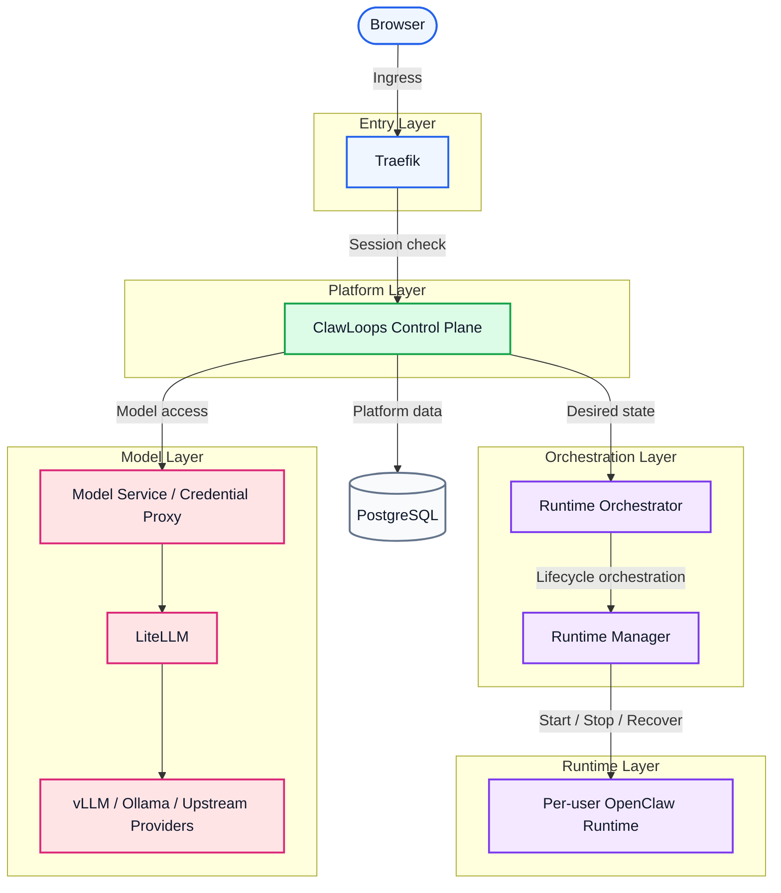

# ClawLoops

English | [中文](README_zh-CN.md) | [한국어](README_ko-KR.md) | [日本語](README_ja-JP.md) | [Español](README_es-ES.md) | [Português](README_pt-BR.md)

ClawLoops is a team-oriented control plane for OpenClaw workspaces, managing users, workspaces, models, and runtimes.

It helps teams provision, access, and manage isolated OpenClaw runtimes per user, while keeping browser ingress, control-plane logic, runtime orchestration, and model access clearly separated.

## 🌟 Project Introduction

- [x] 👥 Team-oriented OpenClaw workspace management
- [x] 🔄 Per-user isolated runtime lifecycle
- [x] 💻 User and admin web console
- [x] ⚙️ Dedicated runtime-manager service for runtime orchestration
- [x] 🤖 Unified model access through LiteLLM
- [x] 🐳 Docker Compose based local deployment
- [x] 🚀 **Native cross-platform (Windows / Linux / macOS) one-click launch for zero-friction onboarding**
- [ ] 🧠 **Seamlessly integrate vLLM and Ollama**, building enterprise-grade local private model clusters
- [ ] 📚 **Built-in shared knowledge base gateway**, enabling multi-tenant RBAC isolation
- [ ] ☁️ **Bidirectional connectivity between cloud sandboxes and local desktops**, enabling a frictionless cloud-native development experience
- [ ] 📊 **Full-stack observability and compliance auditing**, with enterprise-grade visual dashboards
- [ ] ☸️ **Cloud-native K8s elastic scaling architecture**, supporting large-scale orchestration

## 🗺️ Architecture Overview

ClawLoops follows a boundary-first design: browser ingress, access control, control-plane logic, runtime orchestration, per-user runtimes, and model access stay clearly separated for team governance, security isolation, and future scaling.



### Layer Breakdown

| Layer | Components | Responsibilities |
| ---- | ---- | ---- |
| Entry layer | Traefik | Routing, login enforcement, session protection, workspace subdomain access control |
| Platform layer | ClawLoops Control Plane + Web UI | User sync, workspace entry, admin governance, runtime business truth |
| Orchestration layer | Runtime Orchestrator + Runtime Manager | Desired state reconciliation, config rendering, container lifecycle scheduling |
| Runtime layer | Per-user OpenClaw Runtime | Isolated user workspace, runtime configuration, interactive AI environment |
| Model layer | Model Service / Credential Proxy + LiteLLM + Upstream Providers | Unified model access, credential proxying, routing, and aggregation |
| Data layer | PostgreSQL | Persistence for users, workspaces, invitations, and runtime metadata |

### MVP Design Notes

- Each user is mapped to one isolated runtime by default
- `browserUrl` is reserved for browser traffic and `internalEndpoint` is reserved for internal platform calls
- Workspace subdomains remain protected by Traefik
- The control plane owns runtime business state, while Runtime Manager owns the actual container lifecycle

For full details, see [ARCHITECTURE.md](../ARCHITECTURE.md).

## Main Features

- [x] Local username/password authentication with session cookies
- [x] Seed admin bootstrap and forced password change flow
- [x] Invitation-based onboarding
- [x] Admin user management
- [x] Runtime start, stop, delete, and observed-state refresh
- [x] Workspace entry resolution and redirect
- [x] Gateway-backed user-visible model list
- [x] LiteLLM based unified model access
- [x] Runtime lifecycle polling and task-driven status updates
- [ ] Seamless integration of local vLLM and Ollama models, supporting clustered GPU scheduling and smart fallback
- [ ] Team-level shared knowledge base mounting, supporting multi-tenant RBAC isolation and retrieval
- [ ] Native desktop connector for Windows/macOS/Linux, enabling frictionless local code sync to cloud sandboxes
- [ ] Fine-grained enterprise audit logs, visual quota control panels, and automated usage alerts
- [ ] One-click expansion to Kubernetes orchestration, supporting dynamic scaling across hundreds or thousands of nodes

### Extensive Model Ecosystem & AI Tool Support

Thanks to the underlying model gateway and standardized OpenAI/Claude/Gemini-compatible interfaces, this platform **supports (or will soon support)** the following ecosystem:

**Compatible Large Language Models (LLMs)**
- **OpenAI**: GPT-4o+
- **Anthropic Claude**: Claude 3.5+
- **Google Gemini**: Gemini 1.5+
- **DeepSeek**: DeepSeek-V3+
- **Meta Llama**: Llama 3.1+
- **Alibaba Qwen**: Qwen 2.5+
- **Zhipu AI**: GLM-4+
- **Baichuan / Moonshot**: Baichuan+ / Kimi+
- Plus other OpenAI-compatible upstream providers (e.g., OpenRouter+, Together AI+, etc.)

**Seamless Integration with Popular AI Tools & Clients**
- **CLI Tools**: Amp CLI+, Claude Code+, Gemini CLI+, OpenAI Codex CLI+, etc.
- **IDE Extensions**: Cline+, Roo Code+, Claude Proxy VSCode+, Amp IDE extensions+, etc.
- **Desktop & Collaboration Apps**: CodMate+, ProxyPilot+, ZeroLimit+, ProxyPal+, Quotio+, etc.
*(Note: Any client supporting standard OpenAI/Claude protocols can be connected to and managed by this control plane.)*

## Core Components

### `apps/clawloops-api`

FastAPI-based control-plane backend.

- [x] Authentication and session management
- [x] Invitation flow
- [x] User and admin APIs
- [x] Runtime lifecycle business state
- [x] Workspace entry and redirect logic
- [x] Model configuration exposure
- [ ] AI-intent-aware security auditing and an RBAC firewall
- [ ] Cross-cluster distributed data bus for seamless cloud/desktop synchronization

### `apps/clawloops-web`

React + Vite web application.

- [x] Login and onboarding pages
- [x] Dashboard and workspace entry
- [x] Admin console
- [x] User, invitation, model, credential, and usage pages

### `services/runtime-manager`

Dedicated runtime execution service.

- [x] Create, start, stop, and delete OpenClaw runtime containers
- [x] Render and mount runtime configuration
- [x] Report observed runtime state
- [x] Expose internal management endpoints
- [ ] Transparent Kubernetes API integration, supporting large-scale pod scheduling and cross-host hot migration
- [ ] vLLM / Ollama inference sidecar integration, enabling VRAM-level GPU virtualization scheduling

### `infra/compose`

Docker Compose based local deployment entrypoint.

Default services:

- [x] Traefik
- [x] clawloops-api
- [x] clawloops-web
- [x] runtime-manager
- [x] LiteLLM

## Repository Structure

```text
apps/
  clawloops-api/        FastAPI control-plane backend
  clawloops-web/        React + Vite web console
services/
  runtime-manager/      Runtime lifecycle service
infra/
  compose/              Docker Compose deployment
  traefik/              Traefik configuration
contracts/              API and schema contracts
oneclick/               Ubuntu one-click bootstrap
scripts/                Helper scripts and reference materials
README/                 Project README documents
```

## Getting Started

### Prerequisites

Please ensure Docker Engine and Docker Compose are installed on your system, and prepare your LLM provider API keys.

> **Deployment Wizard**: Whether you're on Windows, macOS, or Linux, we've got you covered with one-click startup scripts.
>
> For detailed environment configuration and launch steps, please refer to: [infra/compose Deployment Guide](ClawLoops/infra/compose)

## Runtime and Model Access

- [x] Each user owns at most one runtime in the current MVP
- [x] Workspace URLs remain protected behind Traefik and the authentication layer
- [x] Browser-facing addresses and internal service addresses are not collapsed into a single endpoint
- [x] Runtime-manager is the service that performs actual container lifecycle operations

## Model Gateway and Routing (Current Behavior)

This section consolidates the current implementation from:
- `docs/前端/普通用户默认模型与自带OpenRouterKey方案.md`
- `docs/部署/LiteLLM_模型网关与多路由说明.md`

### 1) User-facing model list source (`GET /api/v1/models`)

The control plane does not expose LiteLLM `model_list` directly.  
The returned list is built with this pipeline:

1. Read governed models (`enabled=true` and `userVisible=true`).
2. Filter by provider readiness (for example, missing `DASHSCOPE_API_KEY` or `OPENROUTER_API_KEY`).
3. Intersect with LiteLLM available models (`GET /v1/models`).
4. Return model metadata including `pricingType` (`free`/`paid`) and `defaultRoute`.

### 2) Admin governance and OpenRouter sync

Admin model governance is exposed via:
- `GET /api/v1/admin/models`
- `PUT /api/v1/admin/models/{model_id}`
- `POST /api/v1/admin/models/sync/openrouter`

`/admin/models` is the primary UI for enabling/disabling models, visibility, pricing type, and syncing OpenRouter catalog entries.

### 3) Model identity vs runtime route

There are three related but different identifiers:

1. Platform `modelId` (governance ID, used by control plane and UI)
2. LiteLLM `model_name` (registered in `infra/compose/litellm.config.yaml`)
3. Runtime execution route (`defaultRoute`, consumed by OpenClaw)

Example:
- `ollama-qwen2.5-7b-free` can map to runtime route `ollama/qwen2.5:7b`.
- `qwen-max-proxy` continues to execute via `litellm/qwen-max-proxy`.

This allows local Ollama models to run through native Ollama routing when needed, instead of forcing every route through LiteLLM OpenAI-compatible forwarding.

### 4) Provider and gateway configuration

Core env vars (compose deployment):
- `CLAWLOOPS_MODEL_GATEWAY_BASE_URL` (usually `http://litellm:4000`)
- `CLAWLOOPS_MODEL_GATEWAY_DEFAULT_MODELS` (must match `model_name` values in LiteLLM config)
- `DASHSCOPE_API_KEY`
- `OPENROUTER_API_KEY`
- `OLLAMA_BASE_URL`
- `LITELLM_MASTER_KEY`

Core files:
- `infra/compose/litellm.config.yaml` (LiteLLM model registration and provider mapping)
- `infra/compose/docker-compose.yml` (service wiring and env injection)
- `infra/compose/README.md` (operator steps and deployment examples)

### 5) Naming convention and pricing semantics

Current naming convention uses suffixes for pricing semantics:
- `*-free`
- `*-paid`

Common examples:
- `ollama-qwen2.5-7b-free`
- `ollama-llama3.1-8b-free`
- `openrouter-glm-4.5-air-free`

### 6) Known behavior in current OpenClaw build

With current OpenClaw `v2026.3.13`, model dropdown display and per-session persistence can differ by client behavior:
- model list can be displayed correctly
- a model switch may not always persist as session override

When this happens, runtime primary model still follows server-rendered defaults (`agents.defaults.model.primary`), and explicit model commands remain a reliable fallback path.

### 7) Reference docs

- `docs/部署/LiteLLM_模型网关与多路由说明.md`
- `docs/前端/普通用户默认模型与自带OpenRouterKey方案.md`

## 🤝 Contributing

ClawLoops grows with community support and co-building. Whether you found a bug, have a great feature idea, or want to improve the docs, you are welcome to join.

You can contribute in a few simple steps:

1. **Fork the repository** to your own GitHub account.
2. **Create a feature branch** (`git checkout -b feature/AmazingFeature`).
3. **Commit your changes** (`git commit -m 'feat: Add some AmazingFeature'`).
4. **Push the branch** to your remote (`git push origin feature/AmazingFeature`).
5. Open a **Pull Request**, and we’ll review it as soon as possible.

We look forward to seeing your ideas and code!

## Open Source License

This project is licensed under the Apache License, Version 2.0.

See [LICENSE](file:///home/neme2080d/Workspace/MasRobo/ClawLoops/LICENSE) for details.
