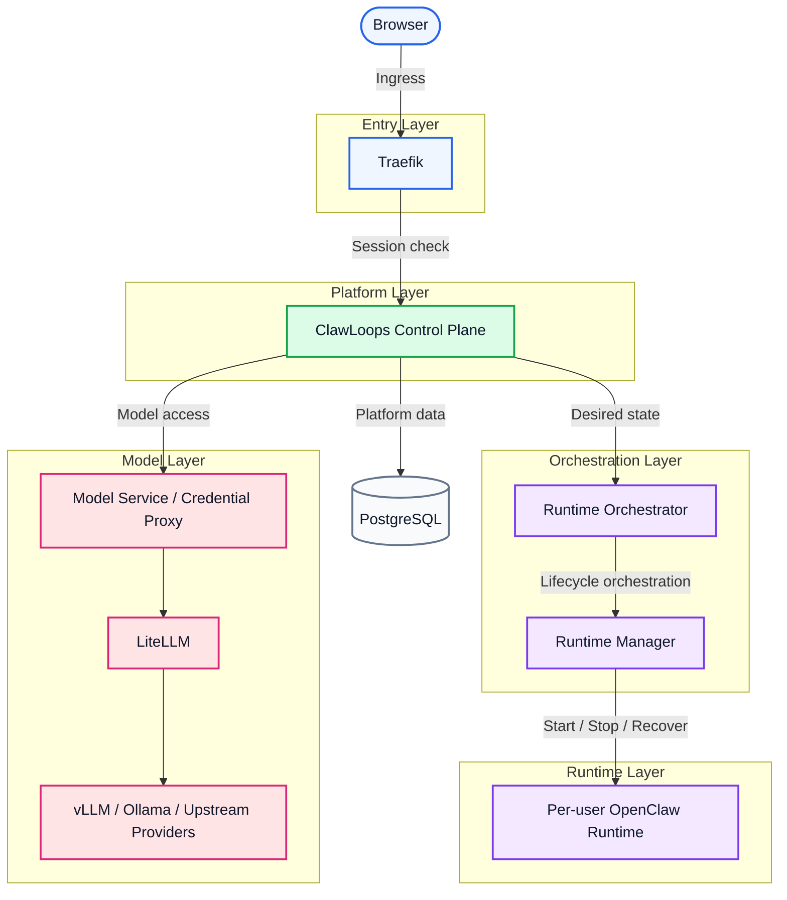

# CrewClaw

[English](README.md) | [中文(简体)](README_zh-CN.md) | [한국어](README_ko-KR.md) | [日本語](README_ja-JP.md) | Español | [Português](README_pt-BR.md)

CrewClaw es un plano de control orientado a equipos para workspaces de OpenClaw, que gestiona usuarios, workspaces, modelos y runtimes.

Ayuda a los equipos a aprovisionar, acceder y administrar runtimes de OpenClaw aislados por usuario, manteniendo bien separadas la entrada del navegador, la lógica del plano de control, la orquestación de runtimes y el acceso a modelos.

## 🌟 Introducción del proyecto

- [x] 👥 Gestión de workspaces de OpenClaw orientada a equipos
- [x] 🔄 Ciclo de vida de runtime aislado por usuario
- [x] 💻 Consola web para usuarios y administradores
- [x] ⚙️ Orquestación de runtimes mediante un servicio runtime-manager dedicado
- [x] 🤖 Acceso unificado a modelos a través de LiteLLM
- [x] 🐳 Despliegue local basado en Docker Compose
- [x] 🚀 **Arranque nativo multiplataforma (Windows / Linux / macOS) con un clic**
- [ ] 🧠 **Integración fluida de vLLM y Ollama**, para clústeres de modelos locales privados de nivel empresarial
- [ ] 📚 **Gateway de base de conocimiento compartida**, con aislamiento multi-tenant y RBAC
- [ ] ☁️ **Conectividad bidireccional entre sandbox en la nube y escritorio local**, para una experiencia sin fricción
- [ ] 📊 **Observabilidad y auditoría de cumplimiento de extremo a extremo**, con paneles empresariales
- [ ] ☸️ **Arquitectura elástica cloud-native en K8s**, para orquestación a gran escala

## 🗺️ Visión general de arquitectura

CrewClaw adopta un diseño “boundary-first”: entrada del navegador, control de acceso, plano de control, orquestación de runtime, runtimes por usuario y acceso a modelos permanecen claramente separados para facilitar gobernanza, aislamiento y escalabilidad.



### Desglose por capas

| Capa | Componentes | Responsabilidades |
| ---- | ---- | ---- |
| Entry layer | Traefik | Enrutamiento, enforcement de login, protección de sesión, control de acceso por subdominio |
| Platform layer | ClawLoops Control Plane + Web UI | Sincronización de usuarios, entrada a workspaces, gobernanza, “business truth” de runtimes |
| Orchestration layer | Runtime Orchestrator + Runtime Manager | Reconciliación de estado deseado, render de configuración, ciclo de vida de contenedores |
| Runtime layer | Per-user OpenClaw Runtime | Workspace aislado por usuario, configuración de runtime, entorno de IA interactivo |
| Model layer | Model Service / Credential Proxy + LiteLLM + Upstream | Acceso unificado a modelos, proxy de credenciales, enrutamiento y agregación |
| Data layer | PostgreSQL | Persistencia de usuarios, workspaces, invitaciones y metadatos de runtime |

### Notas de diseño del MVP

- Cada usuario se asigna a un runtime aislado por defecto
- `browserUrl` se reserva para tráfico del navegador y `internalEndpoint` para llamadas internas
- Los subdominios de workspaces se protegen mediante Traefik
- El plano de control mantiene el estado de negocio; Runtime Manager ejecuta el ciclo de vida real del contenedor

Para más detalles, ver [ARCHITECTURE.md](../ARCHITECTURE.md).

## Funciones principales

- [x] Autenticación local usuario/contraseña con cookies de sesión
- [x] Bootstrap de Seed Admin y flujo de cambio forzado de contraseña
- [x] Onboarding basado en invitaciones
- [x] Gestión de usuarios por administradores
- [x] Inicio/parada/borrado de runtime y actualización de estado observado
- [x] Resolución de entrada a workspace y redirección
- [x] Lista de modelos visibles para el usuario desde el gateway
- [x] Acceso unificado a modelos basado en LiteLLM
- [x] Actualización del ciclo de vida por polling de tareas
- [ ] Integración de modelos locales vLLM/Ollama con scheduling GPU en clúster y fallback
- [ ] Montaje de base de conocimiento compartida con aislamiento RBAC y recuperación
- [ ] Conector de escritorio Windows/macOS/Linux para sincronización local↔sandbox
- [ ] Auditoría empresarial, paneles de cuota y alertas de uso
- [ ] Expansión con un clic a Kubernetes para escalado masivo

### Ecosistema de modelos y herramientas de IA

Gracias al gateway de modelos y a interfaces compatibles con OpenAI/Claude/Gemini, esta plataforma **soporta (o soportará pronto)**:

**LLMs compatibles**

- **OpenAI**: GPT-4o+
- **Anthropic Claude**: Claude 3.5+
- **Google Gemini**: Gemini 1.5+
- **DeepSeek**: DeepSeek-V3+
- **Meta Llama**: Llama 3.1+
- **Alibaba Qwen**: Qwen 2.5+
- **Zhipu AI**: GLM-4+
- **Baichuan / Moonshot**: Baichuan+ / Kimi+
- Además de otros proveedores upstream compatibles con OpenAI (por ejemplo, OpenRouter+, Together AI+, etc.)

**Herramientas y clientes**

- **CLI**: Amp CLI+, Claude Code+, Gemini CLI+, OpenAI Codex CLI+, etc.
- **Extensiones IDE**: Cline+, Roo Code+, Claude Proxy VSCode+, Amp IDE extensions+, etc.
- **Apps de escritorio y colaboración**: CodMate+, ProxyPilot+, ZeroLimit+, ProxyPal+, Quotio+, etc.
  *(Cualquier cliente compatible con el protocolo estándar OpenAI/Claude puede integrarse.)*

## Componentes principales

### `apps/clawloops-api`

Backend del plano de control basado en FastAPI.

- [x] Autenticación y gestión de sesión
- [x] Flujo de invitaciones
- [x] APIs de usuario y administrador
- [x] Estado de negocio del ciclo de vida del runtime
- [x] Resolución de entrada a workspace y lógica de redirección
- [x] Exposición de configuración de modelos
- [ ] Auditoría de seguridad basada en intención de IA y firewall RBAC
- [ ] Bus de datos distribuido multi-clúster para sincronización nube/escritorio sin fricción

### `apps/clawloops-web`

Aplicación web basada en React + Vite.

- [x] Páginas de login y onboarding
- [x] Dashboard y Workspace Entry
- [x] Consola de administración
- [x] Páginas de usuarios, invitaciones, modelos, credenciales y uso

### `services/runtime-manager`

Servicio dedicado de ejecución de runtimes.

- [x] Crear, iniciar, detener y eliminar contenedores de runtime OpenClaw
- [x] Renderizar y montar la configuración del runtime
- [x] Reportar el estado observado del runtime
- [x] Exponer endpoints internos de administración
- [ ] Integración transparente con la API de Kubernetes para scheduling a gran escala y migración en caliente entre hosts
- [ ] Sidecar de inferencia vLLM/Ollama para scheduling con virtualización de GPU a nivel de VRAM

### `infra/compose`

Entrada de despliegue local basada en Docker Compose.

Servicios por defecto:

- [x] Traefik
- [x] clawloops-api
- [x] clawloops-web
- [x] runtime-manager
- [x] LiteLLM

## Estructura del repositorio

```text
apps/
  clawloops-api/        Backend FastAPI del plano de control
  clawloops-web/        Consola web React + Vite
services/
  runtime-manager/      Servicio de ciclo de vida del runtime
infra/
  compose/              Despliegue con Docker Compose
  traefik/              Configuración de Traefik
contracts/              Contratos de API y esquemas
oneclick/               Bootstrap one-click en Ubuntu
scripts/                Scripts auxiliares y materiales de referencia
README/                 Documentación README del proyecto
```

## Primeros pasos

### Requisitos previos

Asegúrate de tener Docker Engine y el plugin Docker Compose instalados, y prepara las API Keys de tu proveedor de LLM.

> **Guía de despliegue**: ofrecemos un arranque con un clic para Windows, macOS y Linux.
>
> Para el proceso detallado de configuración y arranque, consulta: [Guía de despliegue de infra/compose](CrewClaw/infra/compose)

## Runtime y acceso a modelos

- [x] En el MVP actual, cada usuario tiene como máximo un runtime
- [x] Las URLs de workspace permanecen protegidas detrás de Traefik y la capa de autenticación
- [x] La dirección para navegador y el endpoint interno no se unifican en uno solo
- [x] El ciclo de vida real del contenedor lo ejecuta runtime-manager

## 🤝 Contribuir

¡CrewClaw crece gracias a la comunidad! Si encontraste un bug, tienes una idea de mejora o quieres pulir la documentación, tu ayuda es bienvenida.

1. **Haz fork** del repositorio en tu cuenta de GitHub.
2. **Crea una rama de feature** (`git checkout -b feature/AmazingFeature`).
3. **Haz commit** de tus cambios (`git commit -m 'feat: Add some AmazingFeature'`).
4. **Haz push** de tu rama (`git push origin feature/AmazingFeature`).
5. Abre un **Pull Request** y lo revisaremos lo antes posible.

## Licencia

Este proyecto está licenciado bajo Apache License, Version 2.0.

Consulta [LICENSE](../LICENSE) para más detalles.
