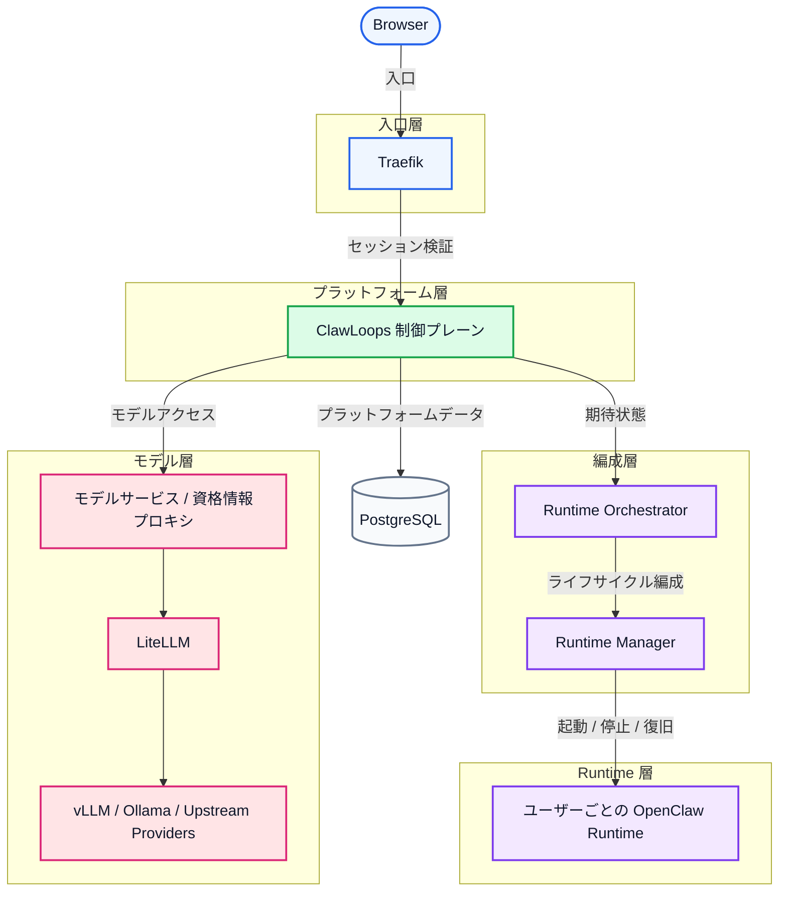

# CrewClaw

[English](README.md) | [中文(简体)](README_zh-CN.md) | [한국어](README_ko-KR.md) | 日本語 | [Español](README_es-ES.md) | [Português](README_pt-BR.md)

CrewClaw は、チーム向けの OpenClaw ワークスペース制御プレーンです。ユーザー、ワークスペース、モデル、Runtime を管理します。

ブラウザ入口、制御プレーン、Runtime 編成、モデルアクセスを明確に分離し、ユーザーごとに分離された OpenClaw Runtime を安全にプロビジョニング／運用できます。

## 🌟 プロジェクト概要

- [x] 👥 チーム向け OpenClaw ワークスペース管理
- [x] 🔄 ユーザーごとの Runtime ライフサイクル
- [x] 💻 ユーザー／管理者向け Web コンソール
- [x] ⚙️ 独立した runtime-manager サービスによる Runtime 編成
- [x] 🤖 LiteLLM による統一モデル接続
- [x] 🐳 Docker Compose ベースのローカルデプロイ
- [x] 🚀 **クロスプラットフォーム（Windows / Linux / macOS）ワンクリック起動**
- [ ] 🧠 **vLLM と Ollama のシームレス統合**（エンタープライズ向けローカル私有モデル基盤）
- [ ] 📚 **共有ナレッジベース・ゲートウェイ**（マルチテナント／RBAC 分離）
- [ ] ☁️ **クラウドサンドボックスとローカルデスクトップの双方向接続**（無摩擦な開発体験）
- [ ] 📊 **可観測性とコンプライアンス監査**（エンタープライズ向けダッシュボード）
- [ ] ☸️ **クラウドネイティブ K8s 弾性スケーリング**（大規模編成）

## 🗺️ アーキテクチャ概要

CrewClaw は境界優先の分層設計を採用します。ブラウザ入口、アクセス制御、制御プレーン、Runtime 編成、ユーザーごとの Runtime、モデルアクセスを分離し、チーム運用と安全隔離、将来の拡張を容易にします。



### レイヤー説明

| レイヤー | コンポーネント | 役割 |
| ---- | ---- | ---- |
| 入口層 | Traefik | ルーティング、ログイン強制、セッション保護、ワークスペースのサブドメイン保護 |
| プラットフォーム層 | ClawLoops 制御プレーン + Web UI | ユーザー同期、ワークスペース入口、管理／ガバナンス、Runtime の業務的真実 |
| 編成層 | Runtime Orchestrator + Runtime Manager | 期待状態の整合、設定レンダリング、コンテナライフサイクル編成 |
| Runtime 層 | ユーザーごとの OpenClaw Runtime | 分離ワークスペース、Runtime 設定、対話型 AI 環境 |
| モデル層 | モデルサービス / 資格情報プロキシ + LiteLLM + 上流 | 統一モデルアクセス、資格情報プロキシ、ルーティング／集約 |
| データ層 | PostgreSQL | ユーザー、ワークスペース、招待、Runtime メタデータの永続化 |

### MVP の設計ポイント

- 各ユーザーはデフォルトで 1 つの分離 Runtime に紐づく
- `browserUrl`（ブラウザ向け）と `internalEndpoint`（内部向け）は明確に分離
- ワークスペースのサブドメインは Traefik で保護
- 制御プレーンが業務状態を保持し、実際のコンテナ操作は Runtime Manager が担当

詳細は [ARCHITECTURE.md](../ARCHITECTURE.md) を参照してください。

## 主な機能

- [x] ローカルのユーザー名／パスワード + セッション Cookie 認証
- [x] Seed Admin 初期化と強制パスワード変更フロー
- [x] 招待ベースのオンボーディング
- [x] 管理者によるユーザー管理
- [x] Runtime の起動／停止／削除／状態更新
- [x] ワークスペース入口の解決とリダイレクト
- [x] モデルゲートウェイからユーザー可視のモデル一覧取得
- [x] LiteLLM による統一モデルアクセス
- [x] タスク／ポーリングによる Runtime ライフサイクル更新
- [ ] vLLM / Ollama ローカルモデルの統合（クラスタ GPU スケジューリング／フォールバック）
- [ ] チーム共有ナレッジベースのマウント（RBAC 分離／検索）
- [ ] Windows/macOS/Linux 向けデスクトップコネクタ（ローカル→クラウドサンドボックス同期）
- [ ] 監査ログ、可視化クォータ、使用量アラート
- [ ] Kubernetes へのワンクリック拡張（大規模スケール）

### モデル生態系と AI ツール対応

基盤となるモデルゲートウェイと OpenAI/Claude/Gemini 互換インターフェースにより、以下を **対応（または今後対応予定）** です：

**互換 LLM**

- **OpenAI**：GPT-4o+
- **Anthropic Claude**：Claude 3.5+
- **Google Gemini**：Gemini 1.5+
- **DeepSeek**：DeepSeek-V3+
- **Meta Llama**：Llama 3.1+
- **Alibaba Qwen**：Qwen 2.5+
- **Zhipu AI**：GLM-4+
- **Baichuan / Moonshot**：Baichuan+ / Kimi+
- その他の OpenAI 互換上流 API（例：OpenRouter+、Together AI+ など）

**AI ツール／クライアント**

- **CLI**：Amp CLI+、Claude Code+、Gemini CLI+、OpenAI Codex CLI+ など
- **IDE 拡張**：Cline+、Roo Code+、Claude Proxy VSCode+、Amp IDE extensions+ など
- **デスクトップ／協業アプリ**：CodMate+、ProxyPilot+、ZeroLimit+、ProxyPal+、Quotio+ など
  *(注：標準 OpenAI/Claude プロトコルに対応していれば接続可能です。)*

## コアコンポーネント

### `apps/clawloops-api`

FastAPI ベースの制御プレーン API。

- [x] 認証とセッション管理
- [x] 招待フロー
- [x] ユーザー／管理者 API
- [x] Runtime ライフサイクル（業務状態）
- [x] ワークスペース入口とリダイレクト
- [x] モデル設定の出力
- [ ] AI 意図ベースのセキュリティ監査と RBAC ファイアウォール
- [ ] クラスタ間分散データバス（クラウド／デスクトップ同期）

### `apps/clawloops-web`

React + Vite ベースの Web アプリ。

- [x] ログイン／オンボーディング
- [x] ダッシュボードと Workspace Entry
- [x] 管理コンソール
- [x] ユーザー／招待／モデル／資格情報／使用量画面

### `services/runtime-manager`

Runtime 実行サービス。

- [x] OpenClaw Runtime コンテナの作成／起動／停止／削除
- [x] Runtime 設定のレンダリングとマウント
- [x] Runtime 観測状態のレポート
- [x] 内部管理 API の提供
- [ ] Kubernetes API 連携（大規模 Pod スケジューリング／ホスト間ホットマイグレーション）
- [ ] vLLM / Ollama 推論サイドカー（VRAM レベルの GPU 仮想化スケジューリング）

### `infra/compose`

Docker Compose によるローカルデプロイ入口。

既定サービス：

- [x] Traefik
- [x] clawloops-api
- [x] clawloops-web
- [x] runtime-manager
- [x] LiteLLM

## リポジトリ構造

```text
apps/
  clawloops-api/        FastAPI 制御プレーンバックエンド
  clawloops-web/        React + Vite Web コンソール
services/
  runtime-manager/      Runtime ライフサイクルサービス
infra/
  compose/              Docker Compose 配置
  traefik/              Traefik 設定
contracts/              API／スキーマ契約
oneclick/               Ubuntu ワンクリック起動
scripts/                補助スクリプト
README/                 README 文書
```

## はじめに

### 前提条件

Docker Engine と Docker Compose プラグインがインストールされていること、ならびに LLM プロバイダの API Key を用意してください。

> **デプロイガイド**：Windows / macOS / Linux 向けにワンクリック起動を用意しています。
>
> 詳細は [infra/compose 部署ガイド](CrewClaw/infra/compose) を参照してください。

## Runtime とモデルアクセス

- [x] 現在の MVP では各ユーザーは最大 1 つの Runtime を保有
- [x] ワークスペース URL は Traefik と認証層で保護
- [x] ブラウザ向けアドレスと内部向けエンドポイントは統合しない
- [x] 実際のコンテナ操作は runtime-manager が担当

## モデルゲートウェイとルーティング（現行挙動）

本節は次のドキュメントにある現行実装を統合した要約です。
- `docs/前端/普通用户默认模型与自带OpenRouterKey方案.md`
- `docs/部署/LiteLLM_模型网关与多路由说明.md`

### 1) ユーザー向けモデル一覧の生成元（`GET /api/v1/models`）

制御プレーンは LiteLLM `model_list` をそのまま公開せず、以下の流れで返します。

1. ガバナンス済みモデル（`enabled=true` かつ `userVisible=true`）を取得
2. Provider 準備状態で絞り込み（例: `DASHSCOPE_API_KEY` / `OPENROUTER_API_KEY`）
3. LiteLLM `GET /v1/models` の可用一覧と積集合を取る
4. `pricingType`（`free`/`paid`）と `defaultRoute` を含むメタ情報を返す

### 2) 管理者ガバナンスと OpenRouter 同期

管理者向けモデル API:
- `GET /api/v1/admin/models`
- `PUT /api/v1/admin/models/{model_id}`
- `POST /api/v1/admin/models/sync/openrouter`

`/admin/models` は公開/非公開、可視性、価格区分、OpenRouter カタログ同期を管理する主画面です。

### 3) モデル識別子と Runtime 実行ルート

現在は次の 3 層を区別します。

1. プラットフォーム `modelId`（ガバナンス/UI 用）
2. LiteLLM `model_name`（`infra/compose/litellm.config.yaml`）
3. Runtime 実行ルート `defaultRoute`（OpenClaw へ配布）

例:
- `ollama-qwen2.5-7b-free` -> `ollama/qwen2.5:7b`
- `qwen-max-proxy` -> `litellm/qwen-max-proxy`

### 4) ゲートウェイ/Provider の主要設定

主要な環境変数:
- `CLAWLOOPS_MODEL_GATEWAY_BASE_URL`（通常 `http://litellm:4000`）
- `CLAWLOOPS_MODEL_GATEWAY_DEFAULT_MODELS`（LiteLLM の `model_name` と一致させる）
- `DASHSCOPE_API_KEY`
- `OPENROUTER_API_KEY`
- `OLLAMA_BASE_URL`
- `LITELLM_MASTER_KEY`

主要ファイル:
- `infra/compose/litellm.config.yaml`
- `infra/compose/docker-compose.yml`
- `infra/compose/README.md`

### 5) 命名規則と価格区分

現行の命名規則:
- `*-free`
- `*-paid`

例:
- `ollama-qwen2.5-7b-free`
- `ollama-llama3.1-8b-free`
- `openrouter-glm-4.5-air-free`

### 6) 現行 OpenClaw バージョンでの既知挙動

OpenClaw `v2026.3.13` では、モデルドロップダウン表示とセッション保持に差が出る場合があります。
- モデル一覧は表示される
- セッション単位の切替保持は常に保証されない

この場合、実行時の主モデルは `agents.defaults.model.primary` に従います。必要に応じて明示的なモデルコマンドを利用してください。

## 🤝 コントリビュート

バグ報告、機能提案、ドキュメント改善など、コミュニティからの貢献を歓迎します。

1. リポジトリを **Fork**
2. 特性ブランチを作成（`git checkout -b feature/AmazingFeature`）
3. 変更をコミット（`git commit -m 'feat: Add some AmazingFeature'`）
4. push（`git push origin feature/AmazingFeature`）
5. **Pull Request** を作成

## ライセンス

Apache License, Version 2.0

詳しくは [LICENSE](file:///home/neme2080d/Workspace/MasRobo/CrewClaw/LICENSE) を参照してください。
