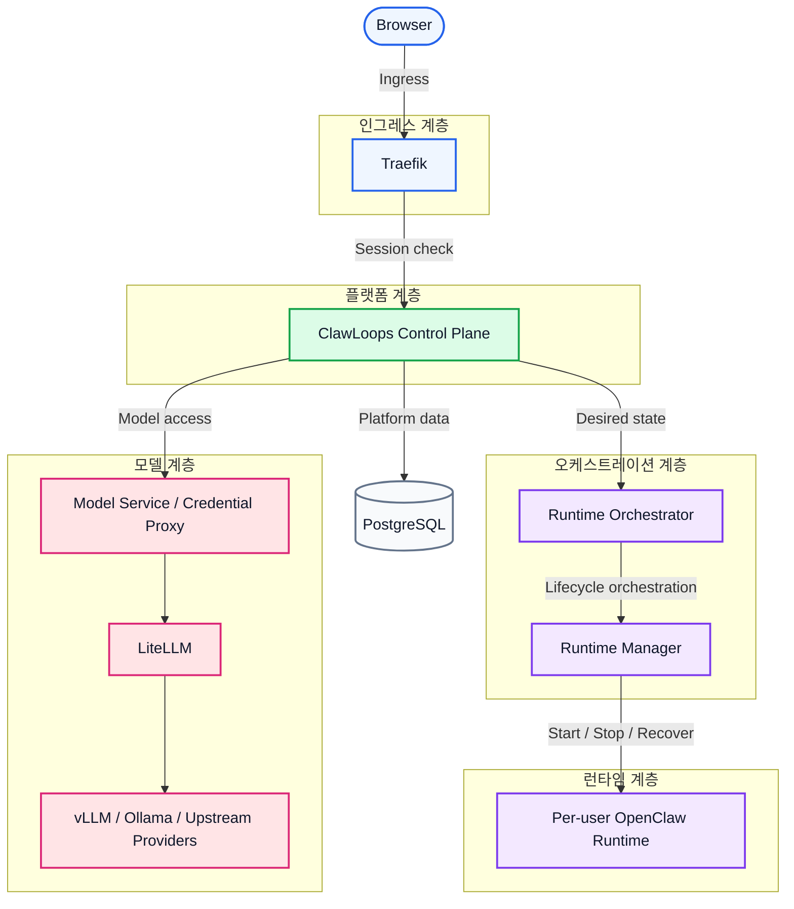

# CrewClaw

[English](README.md) | [中文(简体)](README_zh-CN.md) | 한국어 | [日本語](README_ja-JP.md) | [Español](README_es-ES.md) | [Português](README_pt-BR.md)

CrewClaw는 팀을 위한 OpenClaw 워크스페이스 컨트롤 플레인으로, 사용자/워크스페이스/모델/런타임(Runtime)을 관리합니다.

사용자별로 격리된 OpenClaw Runtime을 안전하게 프로비저닝·접근·운영할 수 있도록 돕고, 브라우저 인그레스, 컨트롤 플레인 로직, 런타임 오케스트레이션, 모델 접근을 명확히 분리합니다.

## 🌟 프로젝트 소개

- [x] 👥 팀 지향 OpenClaw 워크스페이스 관리
- [x] 🔄 사용자별 Runtime 라이프사이클
- [x] 💻 사용자/관리자 Web 콘솔 제공
- [x] ⚙️ 독립 runtime-manager 서비스로 Runtime 오케스트레이션
- [x] 🤖 LiteLLM을 통한 모델 접근 통합
- [x] 🐳 Docker Compose 기반 로컬 배포
- [x] 🚀 **크로스플랫폼(Windows / Linux / macOS) 원클릭 실행**
- [ ] 🧠 **vLLM + Ollama 무중단 통합**, 엔터프라이즈급 로컬 프라이빗 모델 클러스터
- [ ] 📚 **공유 지식베이스 게이트웨이**, 멀티테넌트 및 RBAC 격리
- [ ] ☁️ **클라우드 샌드박스 ↔ 로컬 데스크톱 양방향 연결**, 마찰 없는 클라우드 네이티브 개발 경험
- [ ] 📊 **전방위 관측성 및 컴플라이언스 감사**, 엔터프라이즈 대시보드
- [ ] ☸️ **클라우드 네이티브 K8s 탄력 확장 아키텍처**, 대규모 오케스트레이션

## 🗺️ 아키텍처 개요

CrewClaw는 경계 우선(Boundary-first) 분층 설계를 채택합니다. 브라우저 인그레스, 접근 제어, 컨트롤 플레인, 런타임 오케스트레이션, 사용자별 Runtime, 모델 접근 경로를 분리해 팀 운영/보안 격리/확장을 쉽게 합니다.



### 계층 설명

| 계층 | 구성요소 | 역할 |
| ---- | ---- | ---- |
| 인그레스 계층 | Traefik | 라우팅, 로그인 강제, 세션 보호, 워크스페이스 서브도메인 접근 제어 |
| 플랫폼 계층 | ClawLoops Control Plane + Web UI | 사용자 동기화, 워크스페이스 엔트리, 관리/거버넌스, 런타임 비즈니스 진실 |
| 오케스트레이션 계층 | Runtime Orchestrator + Runtime Manager | 기대 상태 정합, 설정 렌더링, 컨테이너 라이프사이클 스케줄링 |
| 런타임 계층 | Per-user OpenClaw Runtime | 사용자 격리 워크스페이스, 런타임 설정, 대화형 AI 환경 |
| 모델 계층 | Model Service / Credential Proxy + LiteLLM + Upstream | 통합 모델 접근, 자격증명 프록시, 라우팅/집계 |
| 데이터 계층 | PostgreSQL | 사용자/워크스페이스/초대/런타임 메타데이터 영속화 |

### MVP 설계 포인트

- 사용자마다 기본적으로 1개의 격리 Runtime에 매핑
- `browserUrl`(브라우저용)과 `internalEndpoint`(플랫폼 내부용)는 의도적으로 분리
- 워크스페이스 서브도메인은 Traefik으로 보호
- 컨트롤 플레인은 런타임 비즈니스 상태를 소유하고, 실제 컨테이너 라이프사이클은 Runtime Manager가 수행

자세한 내용은 [ARCHITECTURE.md](../ARCHITECTURE.md)를 참고하세요.

## 주요 기능

- [x] 로컬 사용자명/비밀번호 + 세션 쿠키 로그인
- [x] Seed Admin 초기화 및 강제 비밀번호 변경 플로우
- [x] 초대 기반 온보딩
- [x] 관리자 사용자 관리
- [x] Runtime 시작/중지/삭제 및 상태 갱신
- [x] 워크스페이스 엔트리 해석 및 리다이렉트
- [x] 모델 게이트웨이에서 사용자 가시 모델 목록 조회
- [x] LiteLLM 기반 통합 모델 접근
- [x] 태스크 상태 폴링 기반 Runtime 라이프사이클 업데이트
- [ ] vLLM / Ollama 로컬 모델 통합(클러스터 GPU 스케줄링 및 스마트 폴백)
- [ ] 팀 공유 지식베이스 마운트(멀티테넌트 RBAC 격리 및 검색)
- [ ] Windows/macOS/Linux 데스크톱 커넥터(로컬 코드 → 클라우드 샌드박스 동기화)
- [ ] 엔터프라이즈 감사 로그, 시각화 쿼터 패널, 사용량 알림
- [ ] Kubernetes 오케스트레이션으로 원클릭 확장(대규모 탄력 확장)

### 폭넓은 모델 생태계 및 AI 도구 지원

모델 게이트웨이와 표준화된 OpenAI/Claude/Gemini 호환 인터페이스를 통해 **지원(또는 곧 지원)** 하는 생태계는 다음과 같습니다:

**호환 LLM**

- **OpenAI**: GPT-4o+
- **Anthropic Claude**: Claude 3.5+
- **Google Gemini**: Gemini 1.5+
- **DeepSeek**: DeepSeek-V3+
- **Meta Llama**: Llama 3.1+
- **Alibaba Qwen**: Qwen 2.5+
- **Zhipu AI**: GLM-4+
- **Baichuan / Moonshot**: Baichuan+ / Kimi+
- 기타 OpenAI 호환 업스트림 API(예: OpenRouter+, Together AI+ 등)

**AI 도구/클라이언트**

- **CLI**: Amp CLI+, Claude Code+, Gemini CLI+, OpenAI Codex CLI+ 등
- **IDE 확장**: Cline+, Roo Code+, Claude Proxy VSCode+, Amp IDE extensions+ 등
- **데스크톱/협업 앱**: CodMate+, ProxyPilot+, ZeroLimit+, ProxyPal+, Quotio+ 등
  *(표준 OpenAI/Claude 프로토콜을 지원하는 클라이언트라면 연결 가능합니다.)*

## 핵심 구성요소

### `apps/clawloops-api`

FastAPI 기반 컨트롤 플레인 백엔드입니다.

- [x] 인증 및 세션 관리
- [x] 초대(Invite) 플로우
- [x] 사용자/관리자 API
- [x] Runtime 라이프사이클 비즈니스 상태
- [x] 워크스페이스 엔트리 및 리다이렉트 로직
- [x] 모델 설정 노출
- [ ] AI 의도 기반 보안 감사 및 RBAC 방화벽
- [ ] 클라우드/데스크톱 무중단 동기화를 위한 크로스 클러스터 분산 데이터 버스

### `apps/clawloops-web`

React + Vite 기반 Web 애플리케이션입니다.

- [x] 로그인/온보딩 페이지
- [x] 대시보드 및 워크스페이스 엔트리
- [x] 관리자 콘솔
- [x] 사용자/초대/모델/자격증명/사용량 페이지

### `services/runtime-manager`

Runtime 실행 서비스입니다.

- [x] OpenClaw Runtime 컨테이너 생성/시작/중지/삭제
- [x] Runtime 설정 렌더링 및 마운트
- [x] Runtime 관측 상태 보고
- [x] 내부 관리 엔드포인트 제공
- [ ] Kubernetes API 통합(대규모 Pod 스케줄링 및 호스트 간 핫 마이그레이션)
- [ ] vLLM / Ollama 추론 사이드카 통합(GPU VRAM 수준 가상화 스케줄링)

### `infra/compose`

Docker Compose 기반 로컬 배포 엔트리포인트입니다.

기본 서비스:

- [x] Traefik
- [x] clawloops-api
- [x] clawloops-web
- [x] runtime-manager
- [x] LiteLLM

## 저장소 구조

```text
apps/
  clawloops-api/        FastAPI 컨트롤 플레인 백엔드
  clawloops-web/        React + Vite Web 콘솔
services/
  runtime-manager/      Runtime 라이프사이클 서비스
infra/
  compose/              Docker Compose 배포 구성
  traefik/              Traefik 설정
contracts/              API 및 스키마 계약
oneclick/               Ubuntu 원클릭 부트스트랩
scripts/                보조 스크립트 및 참고 자료
README/                 프로젝트 README 문서
```

## 시작하기

### 사전 준비

Docker Engine 및 Docker Compose 플러그인이 설치되어 있어야 하며, LLM 제공자 API Key를 준비하세요.

> **배포 가이드**: Windows/macOS/Linux 환경을 위한 원클릭 부트스트랩을 제공합니다.
>
> 자세한 설정 및 실행 절차는 [infra/compose 배포 가이드](CrewClaw/infra/compose)를 참고하세요.

## Runtime 및 모델 접근

- [x] 현재 MVP에서는 사용자당 최대 1개의 Runtime을 보유
- [x] 워크스페이스 URL은 Traefik 및 인증 계층 뒤에서 보호
- [x] 브라우저용 주소와 내부 서비스 엔드포인트는 하나로 합치지 않음
- [x] 실제 컨테이너 라이프사이클 조작은 runtime-manager가 수행

## 🤝 기여하기

버그 제보, 기능 제안, 문서 개선 등 다양한 방식의 기여를 환영합니다.

1. 저장소 **Fork**
2. 기능 브랜치 생성 (`git checkout -b feature/AmazingFeature`)
3. 변경 커밋 (`git commit -m 'feat: Add some AmazingFeature'`)
4. 푸시 (`git push origin feature/AmazingFeature`)
5. **Pull Request** 생성

## 라이선스

Apache License, Version 2.0

자세한 내용은 [LICENSE](file:///home/neme2080d/Workspace/MasRobo/CrewClaw/LICENSE)를 참고하세요.
