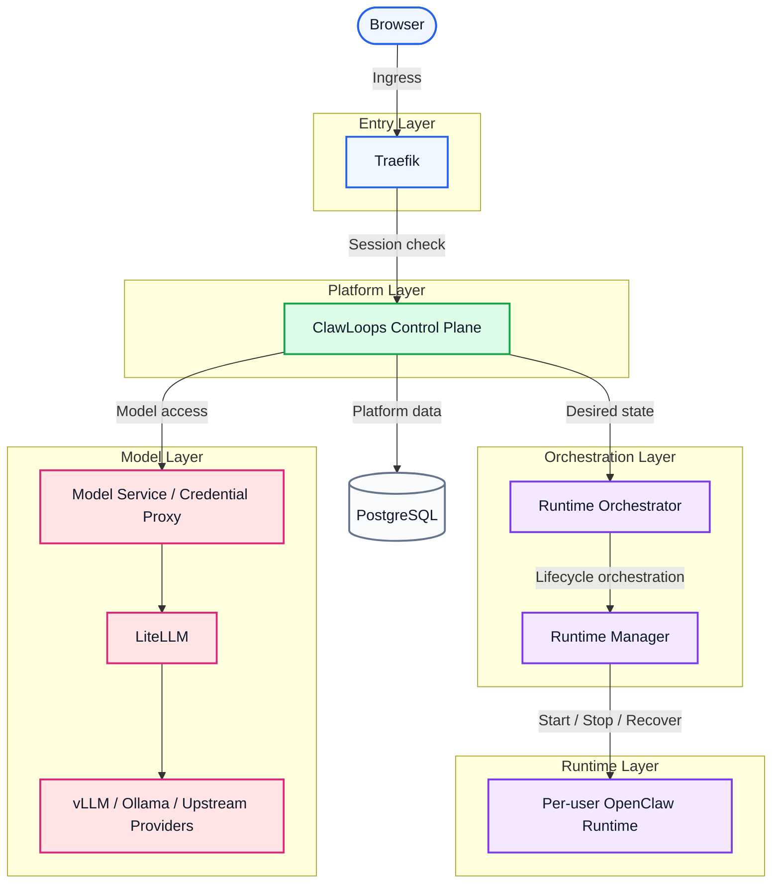

# CrewClaw

[English](README.md) | [中文(简体)](README_zh-CN.md) | [한국어](README_ko-KR.md) | [日本語](README_ja-JP.md) | [Español](README_es-ES.md) | Português

CrewClaw é um plano de controle voltado para equipes para workspaces do OpenClaw, gerenciando usuários, workspaces, modelos e runtimes.

Ele ajuda times a provisionar, acessar e gerenciar runtimes do OpenClaw isolados por usuário, mantendo separados o ingresso do navegador, a lógica do plano de controle, a orquestração de runtimes e o acesso a modelos.

## 🌟 Introdução do projeto

- [x] 👥 Gestão de workspaces OpenClaw voltada para equipes
- [x] 🔄 Ciclo de vida de runtime isolado por usuário
- [x] 💻 Console web para usuários e administradores
- [x] ⚙️ Orquestração de runtimes via serviço runtime-manager dedicado
- [x] 🤖 Acesso unificado a modelos por meio do LiteLLM
- [x] 🐳 Deploy local baseado em Docker Compose
- [x] 🚀 **Inicialização nativa multiplataforma (Windows / Linux / macOS) com um clique**
- [ ] 🧠 **Integração fluida de vLLM e Ollama**, para clusters locais privados de nível enterprise
- [ ] 📚 **Gateway de base de conhecimento compartilhada**, com isolamento multi-tenant e RBAC
- [ ] ☁️ **Conectividade bidirecional entre sandbox na nuvem e desktop local**, para uma experiência sem fricção
- [ ] 📊 **Observabilidade e auditoria de conformidade**, com dashboards enterprise
- [ ] ☸️ **Arquitetura elástica cloud-native em K8s**, para orquestração em larga escala

## 🗺️ Visão geral de arquitetura

O CrewClaw segue um design “boundary-first”: ingresso do navegador, controle de acesso, plano de controle, orquestração de runtime, runtimes por usuário e acesso a modelos ficam claramente separados para governança, isolamento de segurança e escalabilidade.



### Camadas principais

| Camada | Componentes | Responsabilidades |
| ---- | ---- | ---- |
| Entry layer | Traefik | Roteamento, exigência de login, proteção de sessão, controle de acesso por subdomínio |
| Platform layer | ClawLoops Control Plane + Web UI | Sincronização de usuários, entrada de workspace, governança, “verdade de negócio” do runtime |
| Orchestration layer | Runtime Orchestrator + Runtime Manager | Reconciliação de estado desejado, renderização de config, ciclo de vida de contêiner |
| Runtime layer | Per-user OpenClaw Runtime | Workspace isolado por usuário, configuração de runtime, ambiente de IA interativo |
| Model layer | Model Service / Credential Proxy + LiteLLM + Upstream | Acesso unificado a modelos, proxy de credenciais, roteamento e agregação |
| Data layer | PostgreSQL | Persistência de usuários, workspaces, convites e metadados de runtime |

### Notas de design do MVP

- Um runtime isolado por usuário por padrão
- `browserUrl` é reservado para tráfego do navegador e `internalEndpoint` para chamadas internas da plataforma
- Subdomínios de workspace permanecem protegidos pelo Traefik
- O plano de controle mantém o estado de negócio; o Runtime Manager executa o ciclo de vida real do contêiner

Para mais detalhes, veja [ARCHITECTURE.md](../ARCHITECTURE.md).

## Funcionalidades principais

- [x] Autenticação local usuário/senha com cookies de sessão
- [x] Bootstrap do Seed Admin e fluxo de troca forçada de senha
- [x] Onboarding baseado em convite
- [x] Gestão de usuários por administradores
- [x] Start/stop/delete de runtime e atualização de estado observado
- [x] Resolução de entrada de workspace e redirecionamento
- [x] Lista de modelos visíveis ao usuário via gateway
- [x] Acesso unificado a modelos via LiteLLM
- [x] Atualização do ciclo de vida via polling de tarefas
- [ ] Integração de modelos locais vLLM/Ollama com agendamento de GPU em cluster e fallback
- [ ] Montagem de base de conhecimento compartilhada com isolamento RBAC e busca
- [ ] Conector desktop Windows/macOS/Linux para sincronização local↔sandbox
- [ ] Auditoria enterprise, painéis de quota e alertas de uso
- [ ] Expansão com um clique para Kubernetes para escalabilidade massiva

### Ecossistema de modelos e ferramentas de IA

Graças ao gateway de modelos e às interfaces compatíveis com OpenAI/Claude/Gemini, a plataforma **suporta (ou suportará em breve)**:

**LLMs compatíveis**

- **OpenAI**: GPT-4o+
- **Anthropic Claude**: Claude 3.5+
- **Google Gemini**: Gemini 1.5+
- **DeepSeek**: DeepSeek-V3+
- **Meta Llama**: Llama 3.1+
- **Alibaba Qwen**: Qwen 2.5+
- **Zhipu AI**: GLM-4+
- **Baichuan / Moonshot**: Baichuan+ / Kimi+
- Além de outros provedores upstream compatíveis com OpenAI (por exemplo, OpenRouter+, Together AI+, etc.)

**Ferramentas e clientes**

- **CLI**: Amp CLI+, Claude Code+, Gemini CLI+, OpenAI Codex CLI+, etc.
- **Extensões de IDE**: Cline+, Roo Code+, Claude Proxy VSCode+, Amp IDE extensions+, etc.
- **Apps de desktop e colaboração**: CodMate+, ProxyPilot+, ZeroLimit+, ProxyPal+, Quotio+, etc.
  *(Qualquer cliente compatível com o protocolo padrão OpenAI/Claude pode se integrar.)*

## Componentes principais

### `apps/clawloops-api`

Backend do plano de controle baseado em FastAPI.

- [x] Autenticação e gerenciamento de sessão
- [x] Fluxo de convites
- [x] APIs de usuário e administrador
- [x] Estado de negócio do ciclo de vida do runtime
- [x] Resolução de entrada do workspace e lógica de redirecionamento
- [x] Exposição de configuração de modelos
- [ ] Auditoria de segurança baseada em intenção de IA e firewall RBAC
- [ ] Barramento de dados distribuído multi-cluster para sincronização nuvem/desktop sem fricção

### `apps/clawloops-web`

Aplicação web baseada em React + Vite.

- [x] Páginas de login e onboarding
- [x] Dashboard e Workspace Entry
- [x] Console de administração
- [x] Páginas de usuário, convites, modelos, credenciais e uso

### `services/runtime-manager`

Serviço dedicado de execução de runtimes.

- [x] Criar, iniciar, parar e remover contêineres de runtime do OpenClaw
- [x] Renderizar e montar a configuração do runtime
- [x] Reportar o estado observado do runtime
- [x] Expor endpoints internos de administração
- [ ] Integração transparente com a API do Kubernetes para agendamento em larga escala e migração a quente entre hosts
- [ ] Sidecar de inferência vLLM/Ollama para agendamento com virtualização de GPU em nível de VRAM

### `infra/compose`

Entrada de deploy local baseada em Docker Compose.

Serviços padrão:

- [x] Traefik
- [x] clawloops-api
- [x] clawloops-web
- [x] runtime-manager
- [x] LiteLLM

## Estrutura do repositório

```text
apps/
  clawloops-api/        Backend FastAPI do plano de controle
  clawloops-web/        Console web React + Vite
services/
  runtime-manager/      Serviço de ciclo de vida do runtime
infra/
  compose/              Deploy com Docker Compose
  traefik/              Configuração do Traefik
contracts/              Contratos de API e esquemas
oneclick/               Bootstrap one-click no Ubuntu
scripts/                Scripts auxiliares e materiais de referência
README/                 Documentos README do projeto
```

## Primeiros passos

### Pré-requisitos

Garanta que o Docker Engine e o plugin Docker Compose estejam instalados e tenha em mãos as API Keys do seu provedor de LLM.

> **Guia de deploy**: oferecemos inicialização com um clique para Windows, macOS e Linux.
>
> Para o passo a passo de configuração e execução, consulte: [Guia de deploy do infra/compose](CrewClaw/infra/compose)

## Runtime e acesso a modelos

- [x] No MVP atual, cada usuário possui no máximo um runtime
- [x] As URLs de workspace permanecem protegidas atrás do Traefik e da camada de autenticação
- [x] Endereço voltado ao navegador e endpoint interno não são unificados em um único endpoint genérico
- [x] O ciclo de vida real do contêiner é executado pelo runtime-manager

## 🤝 Contribuindo

O CrewClaw cresce com apoio da comunidade. Se você encontrou um bug, tem uma ideia de funcionalidade ou quer melhorar a documentação, sua contribuição é bem-vinda.

1. Faça **fork** do repositório na sua conta do GitHub.
2. **Crie uma branch** (`git checkout -b feature/AmazingFeature`).
3. **Faça commit** das mudanças (`git commit -m 'feat: Add some AmazingFeature'`).
4. **Envie a branch** (`git push origin feature/AmazingFeature`).
5. Abra um **Pull Request** e faremos o review assim que possível.

## Licença

Este projeto é licenciado sob a Apache License, Version 2.0.

Veja [LICENSE](../LICENSE) para detalhes.
