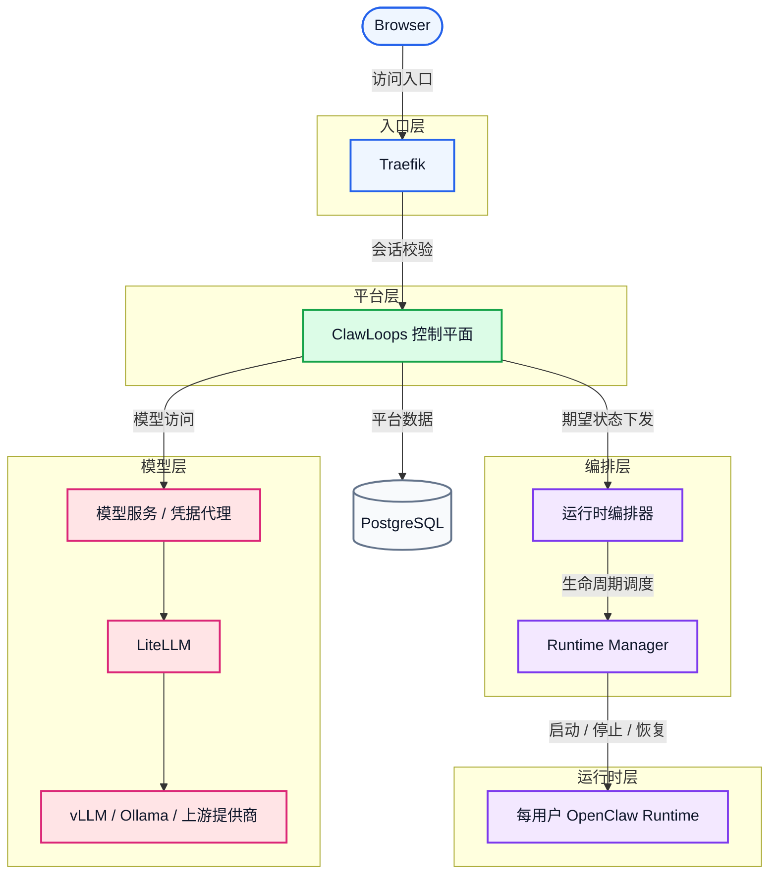

# CrewClaw

[English](README.md) | 中文 | [한국어](README_ko-KR.md) | [日本語](README_ja-JP.md) | [Español](README_es-ES.md) | [Português](README_pt-BR.md)

CrewClaw 是一个面向团队的 OpenClaw 工作区控制平面，用于管理用户、工作区、模型和运行时。

它帮助团队按用户开通、访问和管理隔离的 OpenClaw Runtime，并把浏览器入口、控制平面逻辑、运行时编排和模型访问清晰分层。

## 🌟 项目简介

- [x] 👥 面向团队的 OpenClaw 工作区管理
- [x] 🔄 每用户独立 Runtime 生命周期
- [x] 💻 提供用户端与管理员端 Web 控制台
- [x] ⚙️ 通过独立 runtime-manager 服务编排 Runtime
- [x] 🤖 通过 LiteLLM 统一接入模型
- [x] 🐳 基于 Docker Compose 的本地部署方式
- [x] 🚀 **原生支持跨平台（Windows / Linux / macOS）一键启动，零门槛快速开箱**
- [ ] 🧠 **无缝融合 vLLM 与 Ollama**，打造企业级本地私有模型集群
- [ ] 📚 **内置共享知识库网关**，实现多租户与 RBAC 安全隔离
- [ ] ☁️ **云端沙箱与本地桌面端双向直连**，打造无感的云原生开发体验
- [ ] 📊 **全维度可观测性与合规审计**，提供企业级可视化大屏
- [ ] ☸️ **云原生 K8s 动态伸缩架构**，轻松支撑千节点级别的大规模编排

## 🗺️ 架构概览

CrewClaw 采用边界优先的分层设计：浏览器入口、访问校验、控制平面、运行时编排、每用户 Runtime 与模型访问链路彼此分离，方便团队治理、安全隔离与后续扩展。



### 分层说明

| 层级   | 组件                            | 职责                           |
| ---- | ----------------------------- | ---------------------------- |
| 入口层  | Traefik                       | 路由转发、登录校验、会话保护、工作区子域名访问控制    |
| 平台层  | ClawLoops 控制平面 + Web UI       | 用户同步、工作区入口、管理治理、运行时业务真相      |
| 编排层  | 运行时编排器 + Runtime Manager      | 期望状态对齐、配置渲染、容器生命周期调度         |
| 运行时层 | 每用户 OpenClaw Runtime          | 用户隔离工作区、Runtime 配置、交互式 AI 环境 |
| 模型层  | 模型服务 / 凭据代理 + LiteLLM + 上游提供商 | 统一模型访问、凭据代理、模型路由与聚合          |
| 数据层  | PostgreSQL                    | 用户、工作区、邀请、运行时元数据持久化          |

### MVP 设计要点

- 每个用户默认绑定一个独立 Runtime
- `browserUrl` 只面向浏览器访问，`internalEndpoint` 只面向平台内部调用
- 工作区子域名仍然经过 Traefik 统一保护
- 控制平面维护运行时业务状态，实际容器生命周期由 Runtime Manager 执行

完整设计说明见 [ARCHITECTURE.md](../ARCHITECTURE.md)。

## 主要功能

- [x] 基于本地用户名/密码和 Session Cookie 的登录
- [x] Seed Admin 初始化与强制改密流程
- [x] 基于邀请的用户接入
- [x] 管理员用户管理
- [x] Runtime 启动、停止、删除与状态刷新
- [x] 工作区入口解析与跳转
- [x] 从模型网关获取用户可见模型列表
- [x] 基于 LiteLLM 的统一模型接入
- [x] 通过任务状态轮询驱动 Runtime 生命周期更新
- [ ] 无缝集成 vLLM 与 Ollama 本地模型，支持集群化 GPU 调度与智能回退
- [ ] 团队级共享知识库挂载，支持多租户 RBAC 数据隔离与检索
- [ ] 原生支持 Windows/macOS/Linux 的桌面端直连工具，本地代码无感同步到云端沙箱
- [ ] 细粒度的企业级审计日志、可视化配额控制面板与用量自动告警
- [ ] 一键扩展到 Kubernetes 编排，支持成百上千节点的动态缩扩容

### 广泛的模型生态与 AI 工具支持

得益于底层的模型网关与标准化的 OpenAI/Claude/Gemini 兼容接口，本平台\*\*支持（或即将支持）\*\*以下生态：

**兼容的大语言模型（LLM）**

- **OpenAI**：GPT-4o+
- **Anthropic Claude**：Claude 3.5+
- **Google Gemini**：Gemini 1.5+
- **DeepSeek**：DeepSeek-V3+
- **Meta Llama**：Llama 3.1+
- **阿里通义千问**：Qwen 2.5+
- **智谱 AI**：GLM-4+
- **百川 / Moonshot**：Baichuan+ / Kimi+
- 以及其他 OpenAI 兼容的上游 API（例如 OpenRouter+、Together AI+ 等）

**无缝对接的流行 AI 工具与客户端**

- **CLI 工具**：Amp CLI+、Claude Code+、Gemini CLI+、OpenAI Codex CLI+ 等
- **IDE 扩展**：Cline+、Roo Code+、Claude Proxy VSCode+、Amp IDE 扩展+ 等
- **桌面与协作应用**：CodMate+、ProxyPilot+、ZeroLimit+、ProxyPal+、Quotio+ 等
  *(注：只要客户端支持标准 OpenAI/Claude 协议，均可对接至本控制平面统一管理。)*

## 核心组件

### `apps/clawloops-api`

基于 FastAPI 的控制平面后端。

- [x] 认证与 Session 管理
- [x] 邀请流程
- [x] 用户与管理员 API
- [x] Runtime 生命周期业务状态维护
- [x] 工作区入口与跳转逻辑
- [x] 模型配置输出
- [ ] 集成基于 AI 意图识别的安全审计与 RBAC 防火墙
- [ ] 跨集群分布式数据总线，处理云端/桌面端的无缝同步

### `apps/clawloops-web`

基于 React + Vite 的 Web 应用。

- [x] 登录与引导页面
- [x] Dashboard 与 Workspace Entry
- [x] 管理台
- [x] 用户、邀请、模型、凭据、用量页面

### `services/runtime-manager`

独立的 Runtime 执行服务。

- [x] 创建、启动、停止、删除 OpenClaw Runtime 容器
- [x] 渲染并挂载 Runtime 配置
- [x] 回传 Runtime 观测状态
- [x] 暴露内部管理接口
- [ ] 无感对接 Kubernetes API，支撑大规模节点的 Pod 调度与跨主机热迁移
- [ ] 集成 vLLM / Ollama 推理侧边车 (Sidecar)，实现 GPU 显存级虚拟化调度

### `infra/compose`

基于 Docker Compose 的本地部署入口。

默认服务：

- [x] Traefik
- [x] clawloops-api
- [x] clawloops-web
- [x] runtime-manager
- [x] LiteLLM

## 仓库结构

```text
apps/
  clawloops-api/        FastAPI 控制平面后端
  clawloops-web/        React + Vite Web 控制台
services/
  runtime-manager/      Runtime 生命周期服务
infra/
  compose/              Docker Compose 部署配置
  traefik/              Traefik 配置
contracts/              API 与数据契约
oneclick/               Ubuntu 一键启动
scripts/                辅助脚本与参考资料
README/                 项目 README 文档目录
```

## 新手入门

### 前置条件

请确保系统已安装 Docker Engine 和 Docker Compose 插件，并准备好大模型提供商的 API Key。

> **部署向导**：不论你是使用 Windows、macOS 还是 Linux，我们都为你提供了一键启动方案：
>
> 详细环境配置与启动流程，请直接参阅：[infra/compose 部署指南](CrewClaw/infra/compose)

## Runtime 与访问模型

- [x] 当前 MVP 中每个用户最多拥有一个 Runtime
- [x] 工作区 URL 仍然通过 Traefik 和认证层保护
- [x] 浏览器访问地址和内部服务地址不会合并成一个通用 endpoint
- [x] 真正的容器生命周期操作由 runtime-manager 执行

## 🤝 参与贡献

CrewClaw 的成长离不开社区的支持与共建！无论你是发现了一个 Bug、有绝妙的功能想法，还是想帮忙完善文档，我们都非常期待你的加入。

你可以通过以下几个简单的步骤参与进来：

1. **Fork 本仓库** 到你的 GitHub 账号下。
2. **创建一个特性分支**（`git checkout -b feature/AmazingFeature`）。
3. **提交你的改动**（`git commit -m 'feat: Add some AmazingFeature'`）。
4. **推送分支** 到你的远程仓库（`git push origin feature/AmazingFeature`）。
5. 提交一个 **Pull Request**，我们会尽快进行 Review。

期待你的灵感与代码！

## 开源协议

本项目采用 Apache License, Version 2.0。

详见 [LICENSE](file:///home/neme2080d/Workspace/MasRobo/CrewClaw/LICENSE)。
